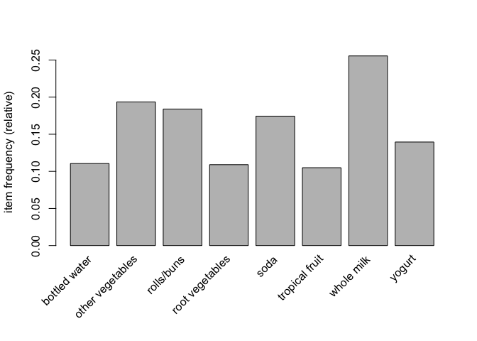
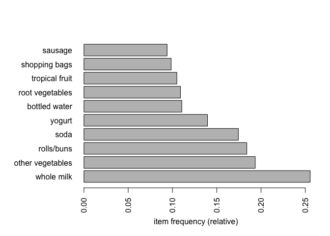
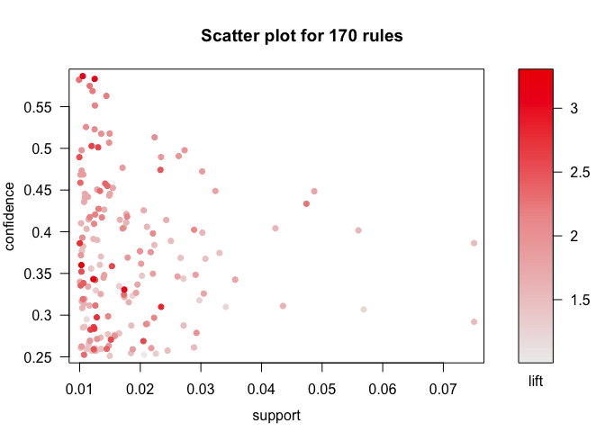
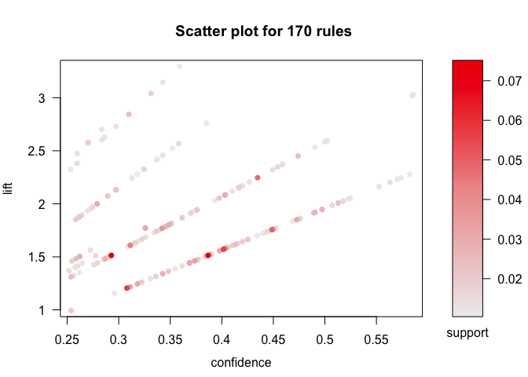
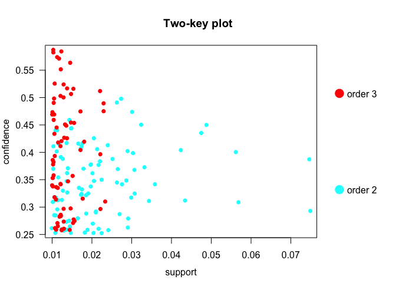
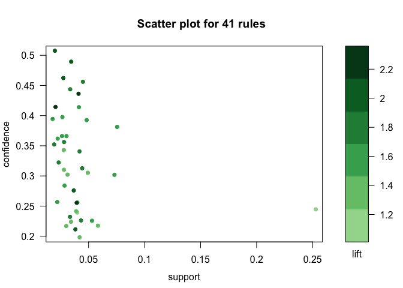
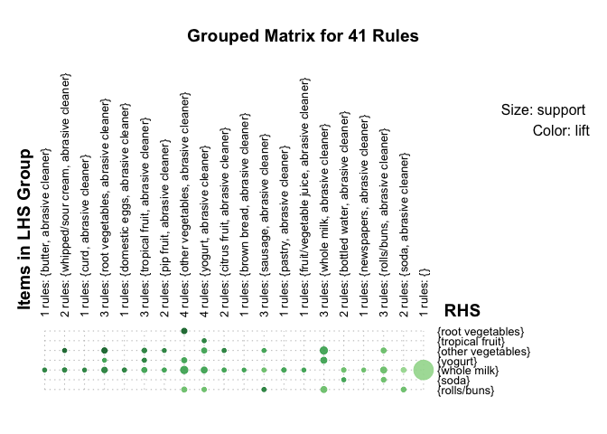
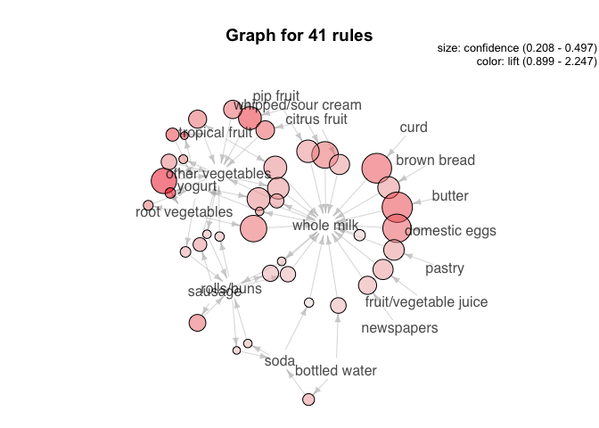

Before the start using the code to change the format of the data, so the data can be analyzed through association rule. Firstly, we need to check the general information about the data. From the summary, it shows there are 169 item and 9835 itemsets. It also shows that which item has been purchased frequently.

    ## transactions as itemMatrix in sparse format with
    ##  9835 rows (elements/itemsets/transactions) and
    ##  169 columns (items) and a density of 0.02609146 
    ## 
    ## most frequent items:
    ##       whole milk other vegetables       rolls/buns             soda 
    ##             2513             1903             1809             1715 
    ##           yogurt          (Other) 
    ##             1372            34055 
    ## 
    ## element (itemset/transaction) length distribution:
    ## sizes
    ##    1    2    3    4    5    6    7    8    9   10   11   12   13   14   15 
    ## 2159 1643 1299 1005  855  645  545  438  350  246  182  117   78   77   55 
    ##   16   17   18   19   20   21   22   23   24   26   27   28   29   32 
    ##   46   29   14   14    9   11    4    6    1    1    1    1    3    1 
    ## 
    ##    Min. 1st Qu.  Median    Mean 3rd Qu.    Max. 
    ##   1.000   2.000   3.000   4.409   6.000  32.000 
    ## 
    ## includes extended item information - examples:
    ##             labels
    ## 1 abrasive cleaner
    ## 2 artif. sweetener
    ## 3   baby cosmetics

    ## [1] "transactions"
    ## attr(,"package")
    ## [1] "arules"

    ## [1] 9835  169

    ##   [1] "abrasive cleaner"          "artif. sweetener"         
    ##   [3] "baby cosmetics"            "baby food"                
    ##   [5] "bags"                      "baking powder"            
    ##   [7] "bathroom cleaner"          "beef"                     
    ##   [9] "berries"                   "beverages"                
    ##  [11] "bottled beer"              "bottled water"            
    ##  [13] "brandy"                    "brown bread"              
    ##  [15] "butter"                    "butter milk"              
    ##  [17] "cake bar"                  "candles"                  
    ##  [19] "candy"                     "canned beer"              
    ##  [21] "canned fish"               "canned fruit"             
    ##  [23] "canned vegetables"         "cat food"                 
    ##  [25] "cereals"                   "chewing gum"              
    ##  [27] "chicken"                   "chocolate"                
    ##  [29] "chocolate marshmallow"     "citrus fruit"             
    ##  [31] "cleaner"                   "cling film/bags"          
    ##  [33] "cocoa drinks"              "coffee"                   
    ##  [35] "condensed milk"            "cooking chocolate"        
    ##  [37] "cookware"                  "cream"                    
    ##  [39] "cream cheese"              "curd"                     
    ##  [41] "curd cheese"               "decalcifier"              
    ##  [43] "dental care"               "dessert"                  
    ##  [45] "detergent"                 "dish cleaner"             
    ##  [47] "dishes"                    "dog food"                 
    ##  [49] "domestic eggs"             "female sanitary products" 
    ##  [51] "finished products"         "fish"                     
    ##  [53] "flour"                     "flower (seeds)"           
    ##  [55] "flower soil/fertilizer"    "frankfurter"              
    ##  [57] "frozen chicken"            "frozen dessert"           
    ##  [59] "frozen fish"               "frozen fruits"            
    ##  [61] "frozen meals"              "frozen potato products"   
    ##  [63] "frozen vegetables"         "fruit/vegetable juice"    
    ##  [65] "grapes"                    "hair spray"               
    ##  [67] "ham"                       "hamburger meat"           
    ##  [69] "hard cheese"               "herbs"                    
    ##  [71] "honey"                     "house keeping products"   
    ##  [73] "hygiene articles"          "ice cream"                
    ##  [75] "instant coffee"            "Instant food products"    
    ##  [77] "jam"                       "ketchup"                  
    ##  [79] "kitchen towels"            "kitchen utensil"          
    ##  [81] "light bulbs"               "liqueur"                  
    ##  [83] "liquor"                    "liquor (appetizer)"       
    ##  [85] "liver loaf"                "long life bakery product" 
    ##  [87] "make up remover"           "male cosmetics"           
    ##  [89] "margarine"                 "mayonnaise"               
    ##  [91] "meat"                      "meat spreads"             
    ##  [93] "misc. beverages"           "mustard"                  
    ##  [95] "napkins"                   "newspapers"               
    ##  [97] "nut snack"                 "nuts/prunes"              
    ##  [99] "oil"                       "onions"                   
    ## [101] "organic products"          "organic sausage"          
    ## [103] "other vegetables"          "packaged fruit/vegetables"
    ## [105] "pasta"                     "pastry"                   
    ## [107] "pet care"                  "photo/film"               
    ## [109] "pickled vegetables"        "pip fruit"                
    ## [111] "popcorn"                   "pork"                     
    ## [113] "potato products"           "potted plants"            
    ## [115] "preservation products"     "processed cheese"         
    ## [117] "prosecco"                  "pudding powder"           
    ## [119] "ready soups"               "red/blush wine"           
    ## [121] "rice"                      "roll products"            
    ## [123] "rolls/buns"                "root vegetables"          
    ## [125] "rubbing alcohol"           "rum"                      
    ## [127] "salad dressing"            "salt"                     
    ## [129] "salty snack"               "sauces"                   
    ## [131] "sausage"                   "seasonal products"        
    ## [133] "semi-finished bread"       "shopping bags"            
    ## [135] "skin care"                 "sliced cheese"            
    ## [137] "snack products"            "soap"                     
    ## [139] "soda"                      "soft cheese"              
    ## [141] "softener"                  "sound storage medium"     
    ## [143] "soups"                     "sparkling wine"           
    ## [145] "specialty bar"             "specialty cheese"         
    ## [147] "specialty chocolate"       "specialty fat"            
    ## [149] "specialty vegetables"      "spices"                   
    ## [151] "spread cheese"             "sugar"                    
    ## [153] "sweet spreads"             "syrup"                    
    ## [155] "tea"                       "tidbits"                  
    ## [157] "toilet cleaner"            "tropical fruit"           
    ## [159] "turkey"                    "UHT-milk"                 
    ## [161] "vinegar"                   "waffles"                  
    ## [163] "whipped/sour cream"        "whisky"                   
    ## [165] "white bread"               "white wine"               
    ## [167] "whole milk"                "yogurt"                   
    ## [169] "zwieback"

we created a “basketSize” which indicate how many item does each itemset has. And create “itemFreq”, which indicates the frequency of each item in the data set. For example, from the summary we know that whole milk has been bought 2513 times. And the frequency of the whole milk should be 2513/9835=0.26. And adding the overall frequency together, it shows how many items each transaction bought in average. The result indicate that each transaction bought 4.409 item averagely. And use itemFreq/sum(itemFreq)\*sum basketSize, we can work out how many times each item has been bought in the dataset.

According to the above, it can plot the frequency of each item, it shows the 10 most frequent item in the data set.

    ##    Min. 1st Qu.  Median    Mean 3rd Qu.    Max. 
    ##   1.000   2.000   3.000   4.409   6.000  32.000

    ##    [1]  4  3  1  4  4  5  1  5  1  2  5  9  1  3  2  4  1  1  1  1  1  2  1
    ##   [24]  5 11  2  1  4  1  6  4  7  5  8  3  2  1  1  4  3  6 13  2  1  8  1
    ##   [47]  2  1  1 10  4  1  4 10  5  4  3  7  6  3  7  2  3  5  3  1  2  2  3
    ##   [70]  8  1  7  8  3  1  4  5  5  4  2  1 10  4  7  1  7  2  3  2  1  1  3
    ##   [93]  4  9  1  2  9 10  3  2  2  9  3 10  1  2  6  7  1  2 10  2  8  2  4
    ##  [116]  3  6  7  3  8  4  4  2  2  1 15  1  1  3  1  2  5  1  2  3  3  1  2
    ##  [139]  1  1  5  3  2  1  7  2 10  5  6  2  6  7  1  6  9  2  1  5  5  5  4
    ##  [162]  3  3  1  4  2  3  3  3  1  8  1  5  1  8  4  2  2  3  5  3  2  2  4
    ##  [185]  2 23  2  7  6  1  1  1  5  2  1  7  1  5  5  3  1  1  2  1  3  2  5
    ##  [208]  2  1  3  6  4  5  4  6  1  2  2  1  2  4  1 12  2  1  6  4  8  3  1
    ##  [231]  6 12  3  8  9  4  5  6  4 16  7  8  3  4 11  4  4  5  6  2  2  9  1
    ##  [254]  1  3  3  1  1 11  4  6  1  1  1  2  1  7 12  1  1  6  5  3  8 11 11
    ##  [277] 11  7  8  1  4 10  1  2  6  5  1  3  1  5  1  9  9  7  6  4  2  1  1
    ##  [300]  4  2 13  1  1  5  5  2  5  9  1  5  6  1  3  4  2  3  1  7  2  3  3
    ##  [323]  2  1  5 11  2  5  9  3  5  2  1  1  1  4  8  1  1  8  4  2  3  1  8
    ##  [346]  3  1  3  6  4  3  5  1  3  5  2  1  1  2  2  1  4  2  8  5  7 10  5
    ##  [369]  7  1  2  2  2  4  2  8  4  4  1  2  1  1  2 11  7  7  3  4  1  4  1
    ##  [392]  1  6  1  1  3  2  4  1  4  4  2 10  4  2  4  1  1  2  1  1  6  5  7
    ##  [415]  4  7  6  6  5  2  6  2  1  1  1  4  1  4  8  4  2  2  3  1  2  1  4
    ##  [438]  3  6  4 11  7  7  1  2  3  9  6  5  5  4  4  7  8  3  8  2  2  1  1
    ##  [461]  1  2  2  3  5 10  3  5  3  3  2  2  8  1  4  5  3  1  4  1  2 14  2
    ##  [484] 11  1  3  6  2  4  3  3  1  4  3  3  2  2  3  4  2  2  3  3  3  6 10
    ##  [507]  2  2  5  2  3  8  1  4  1  1  1 17  2  3  1  2  7  5  2  2  1  7  2
    ##  [530]  4  1  1  1  6  2  4  3  9  4  2  1  2 11  1  3  7  1  5  1  2  2  1
    ##  [553]  2  1  4  1  1  8  1  5  3  6  1  8  2  1  2  5  4  6  1  8  6  1  2
    ##  [576]  1  1  1  3  4  1  5  5  5  2  6  2 13  2  3  1  3  2  2  3 11  5  9
    ##  [599]  2  3  1  1  1  3  9  1  5  6 10  1  1  8  1  9  8  7  5  1  2  4  6
    ##  [622]  9  7  2 10 11  3  4  5 11 10  9  3 12  2  7  3  8  1  1  2  9  5 10
    ##  [645]  6  1  4  1  6 10  2  1  1  2  2  3  1  3  8  3  7  6  4  6  1  4  3
    ##  [668]  3  5  4  1  1 11  3  9  4  3  7 11  5  5  5  2  3  8  3  1  2  1  5
    ##  [691]  5  1  4  4  7  5  7  7  5  4  5  2  3  4  4  1  7  5  8  8  7  5  2
    ##  [714]  1  2  2  2  1  2  1  2  1  7  2  1  5  5  4  4  3  6  7  6 10  3  1
    ##  [737]  3  4  1  6  5  6  3  4  4  1  3  1  2  2  3  3  5  1  3  1  1  1  4
    ##  [760]  6 14  7  9  2  6  2  3  1  4  2  5  8  9  3  3  5  6  4  1  3  3 17
    ##  [783]  8  4  2  1  6  3  2  4  1  9  5  2 13 11 13  4  1  2  4  8  1  8  5
    ##  [806]  5  2  1  6  5  9  2  1  5  2  1  9  8  5  5 11  5  9 12  3  6  1  9
    ##  [829]  3  7  2  6 10  2  1  2  1  1  1  4  4  2  7 12  8  6  2  2 10  8 11
    ##  [852]  1 11  7 13  7  2  1  5 12 15 14  2  1 12  4  4  8  7  2  4  8  3 12
    ##  [875]  4  1  2  2  3  2  2  5  3  9  1  6  2  7  7  3  3  1  6  9  2  2  3
    ##  [898]  5  5  3  2  4  7  3 14  3  1  8  1  8  2  3  7  5  2  6 15  8  6  3
    ##  [921]  8  7  2  8  2  2  2  6  1  5 15  8  2  1  2  2  8  5  2  2  3  3  4
    ##  [944]  1  1  4  3  7 19  8  2  3  3  2  1  2  6  3  8  5  3 10  3  1  1  3
    ##  [967]  8  5  4  4  9  5  1  5  9  4  3  1  3 17 20  3  7  6  4  2  4  9  6
    ##  [990] 16 16  1  3 11  2  3 23  1  5 10  4 10  5 10  6  2  2  3  4  1  4 18
    ## [1013]  7 12  2  2 13  1  5  2  1  5  2  4  4  1  8  2  1  5  4  4  2 13  8
    ## [1036]  5  3  1  2  6  1  7  4  1  5 10 15  1  1  6 10  2  9  3  1  3 14  4
    ## [1059]  5  1  3  2  2 14  1 11  6 13  5  8  1  1 14  7 10  1  8  6  1  2  3
    ## [1082] 15 11 21 18  6  6  3  3 11  4 26  7  3  1 13  1  4  8  1  5 11  9  7
    ## [1105] 11  8  2  2  6 10  7  2  6  7 16  1  2  1  1  4  3 17  9  7  1  5  6
    ## [1128]  5  1  4  6  2  5  5  4  1  1  4  1  2  1  6  7 10  7  7  1 15  9 11
    ## [1151]  2  5  2  4  1  8  9  1  4  1  2  4  1  1  4  2  4  5 11  9 14  6  3
    ## [1174]  5  6  1  2  3  4  5  3  1 10  3  7  2  5  8  6 10  1  1  2  3  3  2
    ## [1197]  2 15  6  2  9 12  1  4  5  5  6  5  5  3  6 16  5  4  1  5 32 12  9
    ## [1220] 15  1 10  5  4  5  2  9  8 19  4  3  4  2  1  7  1 12  5  4 10  2  4
    ## [1243]  3 13  7  1  6  9  6  1  1  1 11  3 12 18  4  1  1  2  4  2 17  2  1
    ## [1266]  1  3 10  1 10  3  5  5  8  6  5  2  1 10  7  5  7  9 10 14  1  5  4
    ## [1289]  1  3  6  2  2  9  4  5  2  1  4  1  8  5 11 10  9  2  5 13  7 11  7
    ## [1312]  8 13  2  3  3  1  1  6  1  2  4 10 11  6  2  3  3  4  4  9 14  7  2
    ## [1335]  4  2  3 14  6  1  6  3  5  3  5 14  2  5  2 17  3 17  4 19  1  5  1
    ## [1358]  2  3  4  6  3 12  5  4  7  1  5  4  2  1  4  1  2 11  1  2  3  3  3
    ## [1381]  5  4  2  4  7 12  3  4  4  1  8 10 12  2  3  1  4  1  4 11  4 10  1
    ## [1404]  1  2  7  3  2  1  4  9  1  2  6  2  1  1  5  6  2 15  1  4  1  1  2
    ## [1427]  2  1  4  1  2  7  3  4  4  4  1  3 15  1  2  3 10  9  6 11  4  2  3
    ## [1450]  6  1  1  5  3  1  7  3  1  2  4  4  1  1  7  1  5  1  2  9  1  2  4
    ## [1473]  1  5  1  2  2  5  4  1  8  3  2  1  2  4  5  2  4  4  1  2  9  1  7
    ## [1496]  4  4  3  1  4  4  3  1  2  6  2  5  7  6  1  5  5  1  2  2  1 15  6
    ## [1519]  6  6  2  2  7  3  4  5  3  3  3  1  1  3  1  5  4  7  8  7  4  3  7
    ## [1542]  2  8  4  3  5  3  1  7  1 10  6  1  3  6  5  1 10  5  7  1  1  1  3
    ## [1565]  7  5 10  1  6  4  1  1  3  3  2  3  3 12  4  6  5  3  1  1  1  2  2
    ## [1588]  3  2 13  3 13  3 10  1  5  2  5  2  4  6  2  3  4  8  1 10  2  3  2
    ## [1611]  4  3 13  1  6  3  4  2  2  5  5  4  4  6  5  2  2  2  1  3  1  1  4
    ## [1634]  3  1  3  1  5  3  1  2  1  2  1  1  1  1  3  1  2 10  1  2  7  1  1
    ## [1657]  1  5  6  1  4  4  2  2  2 10  4  9  3  2  6  6  9  1  2  2  3  6  2
    ## [1680]  7  1  6 10  1  5  4 15  8  4  5  1  5  7  8 15  9  3  4  2  3  1  5
    ## [1703]  2  4  7  4  2  2  4  5  8  9 11  1  2  1 12  8  7  5  3  9  1  3  8
    ## [1726]  4  5  1  1  2  3  2  2  2  4  2  6  1  6  3  1  1  4  1  5  1  1  2
    ## [1749]  1  5  6  1  1 12  2  4  2  4  1  2  3  1  6  1  4  2  2  5  1  4  3
    ## [1772]  6  7  8 10  1  6  2  1  4  5  1  3  3  2  4  1  4  4  3  5  2  1  6
    ## [1795]  3  1  2 17  3  2  5  4  3  1  1 11  1  5  4  1  1  1  5  5 11  5  3
    ## [1818]  2  1  1  3  3 10 12  8  3 17  1  2  1  5  7  8  2  3  9  6  2  7  5
    ## [1841]  6  7  5  5  2  8  6  1  1  3  4  2  4 11  2  1  9  1  1  2  5  2  3
    ## [1864] 10  5  2  2  9  8  1  2  1  1  5  6  2  4  5 10  1  3  9  5  5 11  5
    ## [1887]  3  2  5 12  2  7 11  2  1 11  3  6  9  1  1  1  5  3  5 21  3  1  1
    ## [1910]  1  1  1 16  9  7 14  3  6 10  4 12 15  4  6  1  1 10  4  8  1  5  3
    ## [1933] 19  6  2  8  7  2  2  1  3 12  5 10  2  8  2  2  5  5  1  6  3  3  2
    ## [1956]  4  2  2  2  1  4  5  7  1  6 11  1  2  3  2  1  3  2  2  3  1  6  3
    ## [1979]  5  2  4  1  6  1  3  1  1  3  2  2  9 10  1  2 10  2  7  3  3  3  3
    ## [2002]  3  2  4  9  2  3  4  7  1 16  1  2  6  4 16  5 17  4  7  3 11  3  8
    ## [2025]  3 10  3  1  1  2  1  1  3  2 10 10  1  1  2  5  5  1  6  1  2  1  1
    ## [2048]  5  2  1  7 16  1  4  8  4  3  7  3  2  5  3 15  4  7  2  4  2  3  5
    ## [2071]  3  7  2  7  4  7  8  4  3  2  9  1  2  7  3  8  2  7  8 13  3  1  6
    ## [2094]  6  1  2  5  7  7  4  8  1  5  3  2  5  2  6  2  6  2  2  5  4  3 10
    ## [2117]  2  6  2  4  4  7  1  8  2  4  2  1  1  1  8  3  4  5  4  7  2  9  8
    ## [2140]  8  2  2  1  3  9  7  3  3  8  1  2 11  1  2  1  7  5  6  1  2  6  5
    ## [2163]  1  3  1  8  1  2 12 22  2  8  1  2  2  5  2  5  1  4  6  6  4  5  2
    ## [2186] 13  3  3  2  1  1  3  1  2 10  2  9  2 11  2  1  2  5  5  3  7  4  2
    ## [2209] 15  4  3  7  5  9  4  5  7  6  6  1  3  2  8  9  7  3  7  9  2 10  3
    ## [2232]  1  1  7  2  4  4  1  1  8  8  1  5  3  6  8  4  3  1  3  4  1  5  1
    ## [2255]  2  6  1  4  4  1  3 13  2  3  3  2  9  7  2  2 11  4  1  9  2  3  7
    ## [2278]  2  3  7  4  6  6  2  2  3  4  2  4  3  1  4  6  2  3  4  2  7  1  8
    ## [2301]  5  4  7  2  1  5  5  1  7  7  1  4  8  1  4  6  4  1  1  4  7  1  5
    ## [2324] 15  2  3  3  4  5  2  2  1  8  9  4  3  2  7  2  1  1  3  5  9  4 16
    ## [2347]  2  5  5  9  3  1  1  4  3  5  6  3  5  2  1  3  2  2  4  4  2  7  1
    ## [2370]  2  3  1 11  7  2  1  4  3  5  6  3  3  3  4  2  2  1  8  6  3  7  2
    ## [2393]  3  2  1  3  3  4  1  2  2  9  6  2  7  2  1  1  1  4  3  5  5  1  4
    ## [2416]  6  5  2  1  2  1  2  2  5  1  3  3  8  2  3  2  2  9  3  2  6  9  8
    ## [2439]  3  1  1  7  2  3 14  2  1  1  7  2  4  3  5  3  8  5  2  5  2  5  2
    ## [2462]  9  6  1  6  6  1 12  4 22  1  3 11 10  3  5  1  5  7  6  1  1  5  3
    ## [2485]  6  4  3  1  3  7  2  2  2  3  2  1  1  1  6  4  1 10  5  1  4  5  2
    ## [2508]  6  5  7  8  4  9  9  2  3  8  1  6 14  3  6  5  2  5  9 12  7  2  6
    ## [2531]  3  1 15  1  4 13  1  6  3  4  7  6  6 12  2  8  1  9  1  3  7  3  6
    ## [2554] 11  2  4  1  1  8  9 12  2  4  2  2  6  1  3  1  1  2  4  2 19  4  1
    ## [2577] 11  3  4  1  6  1  8  1 10  1  3  7  3  6  1  1  1  6  2  3 13  1  5
    ## [2600] 13  3  1  1  8  3  1  3  3  1  3  5  4  2  4  7  2  4  1  4  3  6  4
    ## [2623]  3  3  5  1  2  3  3  9  1  8  4  7  9  5  7  1  1  1  6  8  1  3 11
    ## [2646]  4  6  4  2  1  4  4  1  1  1  4  3 11  3  2  7  7  7  7  2  8  3  7
    ## [2669]  2  4  5  1  4  1  2  2  2  1  2  7  1  7  2 17  5  3  4  3  7  1  3
    ## [2692]  2  4  1  7  6  1  2  4  7  1  2 10  4 16  2  1  3  1 16  2  2  9  2
    ## [2715]  3  4  6 19  4  3  7  8  2  3  3  8  2  5  8  1  7 11 10  1  1  2  5
    ## [2738]  2  3  1  6  4  1  6 13  4  6  1  2 11  2  1  5  2  8  9  4 10  4  5
    ## [2761]  6  6  6  3  1 10  5  1  2  3  2  1  9  1  5  9  1  2  6  2 14  7  3
    ## [2784]  9  4  6  2  1  3  1  1  1  1  2  2 10  2  3  1  1  2  2 10  2  2  1
    ## [2807]  1  1  1  2  1  2  1  1  5  6  2  5  2  3  1  1  1  2  7  9  3  1  1
    ## [2830]  4  3  6  1  6  4  2  7  2  2  1  6  2 16  3  1  3  5  9  3  5  5  1
    ## [2853]  3  1  1  1 15  3  2  1  4  1  3  8  3  5  1  2  7  1  2  2  3  1  4
    ## [2876]  6  1  4  6  1 16  5  2  2  3  2  1  2  5  1  3  1  4  2  1  1  3  2
    ## [2899]  8  2  1  7  4  4  4  3  5  2  4  8  7  1  1  1  1  1  1  2  1  1  2
    ## [2922]  1  2  1  1  4  1 14  4  1  2  1  4  2  1  1  1  9 29  1  2  7  5  5
    ## [2945]  2  2  5 23  1  1  8  4  6 12  6  1 11  1  1  5  7  6  6  2  3  1  3
    ## [2968]  3 12  2 12  9  5 29  5  4  1  2  1  2  1  6  9  1 11  3  1 12  4  3
    ## [2991]  3  6  1  2  1 11  5  8  7  9  2  5 12  2  8 20  1  5  2 13  4  5  1
    ## [3014]  1  1 10  5  5  5  1  1  3 13  7  1  4  7  8  1  1  3 16  2  1  1  8
    ## [3037]  5  1 12  1  1 14 12  8  4 17  5  1 12  4  9 11  4  4  3  2  2  2 14
    ## [3060]  8  3  8  2  8  2  7 11  3 15 11  1  3  8  9  1  7  1  3  8 11  1  3
    ## [3083]  1  9  6  4 10  2  3  9 12  3  1  1  1  2  2  1  1  8  3  1  3  5  4
    ## [3106]  2  1  2  9  2  2  4 15  3  2  3  1  5 12  9  1  1  1  4  1  5  1  9
    ## [3129]  2  2  3  2  7  8  4 10  1  1  2  7  6  7  1  8  4  1  4  4  8 12  5
    ## [3152]  5  6  5  2  3 12  5  4  5  1  3  3  1  1  2  3 12  4  4  8  5  3  3
    ## [3175]  6 16  1 15  6  8  1  7 10  1  3  7  2  1  1 11  7  1  8  1 12  7 14
    ## [3198]  2  9  1  3  2  7  9  1  2  8  4 11  4  2  1  1 10  6  6  5  1  1  7
    ## [3221]  9 14  7  8  6  4  5  6  1  1  1  3  1  7  2  3  1  1  5  1  3 13  8
    ## [3244]  8  8  2  3  1  7  3  1  1  1  1  2  6  4  9  2  8 13  8  9  4  1  2
    ## [3267]  3  7  9  9 18  8  1  1  6  1  1  1 10  4  3  4  1  3  5  2  1  3  5
    ## [3290]  2  1  8  3  2  9  9  1  2  1  1  7  1  3  1  1 12  2  8  5  8  2  1
    ## [3313]  1  1  1 13  1  7  7  1  5  1  1 13  2  4  1  1  5  8  6  5  2  1 13
    ## [3336]  4  5  5  7  3  4  2 10  1  8  4  5  2  1  1  1  6  4  2  6  9  4  4
    ## [3359]  7  6  2  1  2  9  2  5  6 13  3  1  4  8  2  3  8  2  3  1  2  2 16
    ## [3382]  9  4  7  3  3  2  7  4 16  2  7  1  3  5 16  1  1  1  3  5  6  4  2
    ## [3405]  6  1  2  1  2  3 11  5  2  4  6  2  2  4  1  3  4  4  1  3  3  1  2
    ## [3428]  3  6  2  2  3  1  1  8  2  6  2  5  2  2  7  7  1  2  7  2  7  5  1
    ## [3451]  8  1  1  8  4  6  1  1  5  2  2  1  9  1  4 15  2  9  5  5  1  1  1
    ## [3474]  5  7  6  2  2  1  5  4  1  2  3  4  6  2  7  2 14  3  2  5  9  9  1
    ## [3497]  2  3  1 17 14  2  6  5  2  6  7 15  6  4  2  3  2  1  4  1  1  2  2
    ## [3520]  7  2  1  2  2  1  2  4  4  1  7  3  3  5  1  3  1  2  3  5  5  5  1
    ## [3543]  1  2  4  3  4 10  6  1  6  5  1  4  1  8  6 14  1  8  2  3  2  2  2
    ## [3566]  2  1  3  2  1  1  3  3  1  4 11  5  1  3  1  1  1  9  2  2  8  1  9
    ## [3589]  1 16  9  1  7  6  1 12  5  3  1  3  4  2  3  7  1  3  6  5  5  6  8
    ## [3612]  6  1  3  5  1  7  1  6  1  1 10  2  4  9  5  5  1  3  5  4  9  7  1
    ## [3635]  3  2  4  2  1  1  9  4  4  1  4  1  4  2  1  1  1  1  3  1  1 12  2
    ## [3658]  2  2  1  3  4  1  2  1 14  2  1 18  4  4  7  5 13  4 13  3  5 11  3
    ## [3681]  3  3  1  6  4  1  9  2 10  2  8  9  6  6  9  3  3  2  1  3  6  7  7
    ## [3704]  4  1  6  1  8  3  1  7  1  2  2  3  7  3 11  1  5  2  1  1  3  8  5
    ## [3727]  3  6  1 10  5  1  1  1  3  2  2  8  1  6  9  9  1  4  1  1  2  5  2
    ## [3750]  9  9  8  2  1  6  5  7  1  6  2  4  9  3  1  2  3  1  4  1  3  5  1
    ## [3773] 11  1  4  1  1  2  9  3  5  1  1  2  2  7  8  4  1  3  4  3  1  1  8
    ## [3796]  1  2  1  1  6  4  2  1  2  1  1  1  7  3  3 11  1  2  2  4  7  3  2
    ## [3819]  8  1  1  4  5  2  6  1  2  3  3  2  5  5  4  5  2  3  2  6  6  3  4
    ## [3842]  1  3  1 15 10  1  2  7  6  1 17  2  1  5  3  1  4  1  2  4  1  2  3
    ## [3865] 10  5  9  3  3  3  1  1  1  2  2  5  3  6  4  1  1  3  1 18  9  4  4
    ## [3888]  3  5  1 10  4  3  1 17 14  3  4  4  1  1  9 14  5  5  8  2  2  5  3
    ## [3911] 12  7  3  7 14  5  1  8  1  9  6  2  7  4  1  2  7 10  1  7  2  1  2
    ## [3934]  3  4  6  1  4  3 10  1 14  4  9  2  1  2 10  3  9  3  7  7  9 11 10
    ## [3957]  5  4  6  9  1  5  6  3  6  2  2  9  1 13 19 13  2 14  2  1  3  9  1
    ## [3980]  8  1  5  5  7 11  5  1  1  4  2  1 12  2  7  1  6  7  2  3  1 14  1
    ## [4003]  5  1  4  1  1  2  1  9  4 12  1  5  2  2 14  1  6  1  1  1  1  1 10
    ## [4026]  3  2  2  3  2  2  7 14  9  3 15  2  3  6  6  1  3  2  2 11  1  9  7
    ## [4049]  8  3  2 10  4 10  3 15  7  4  6 19  5  1  3 10  2 11  4  6  5  5  1
    ## [4072] 13  6 13  1  2  3  2  7  5  8  1  6 10  2  1 12  3  7  7  5 10  1  1
    ## [4095]  2  5  9  1  1  3  6  3  3  2 21  1 10  6  5  4  6  8  3  5  2  7  3
    ## [4118]  2 10 14 10  3  4  8  7 11 12  5  1  5  1  3  3  8  2  1 13  8  4  5
    ## [4141]  8  1  1  4  9  2  1  1  3  2  4  4  8  1  9  7  9  6 16  1  1  1  9
    ## [4164] 12  1  8  7 12  2  5  2  6 10  8 10  3  4  1 10 12  1  6  9  4  1  8
    ## [4187]  1  7  3  2 22  5 11  7  2  2  1  1  1  1  7  2  1  2 14 14  1  4  7
    ## [4210]  1  7  1  8 18  5  1 14  1 10  6  3  8  7  3  1  1  2  5  1 10 21  9
    ## [4233]  8  9 11  6  1 12  2  4  4  1  4  1  5  4 13  8  6  4  2  9  5  1  1
    ## [4256]  4 10  6  1  7  9  1  6  3  2  1  4  1  8  3  4  8  3  4  4  4  2  2
    ## [4279]  1  6  4  6  2  1  2  2  9 12  9  2  5  1  5  5  7  3  6  1  4  1  3
    ## [4302]  6  8  5  3  1  8  3  1  1  9  5 10  8  4  1  2  2  4  3  4  2  1  6
    ## [4325] 11  4  8  2  4 11  1  4  8  3  1 15  1  2  9  3  4  1 11  8  6  6 12
    ## [4348]  1  6  3  1  1  1  6  9  1  2  6  1  8  7  4  8  6  2  3 11  3 11  3
    ## [4371]  3  6  1  7 14  5  1  9  4  3 12  5  6  3  7  3  6  3  8  8 11  2  9
    ## [4394]  1 13  9  7  5  8 11  2  3  5  4 10 12  4  1  4 10  4  8  7  2 15 11
    ## [4417] 19  3  8 20  7  1  5  2  4  2  6  2 12  9 27  8  7  5  7  8  2  1  1
    ## [4440]  9  4  2  2  8  6 10  1 10 20 13  7  1  5  6 19  6  9  5 11  8  7  2
    ## [4463]  7  1  4  2 10  3  3  2  2 10  3  2  1  5  6  2  4  7  3  1  1  4  6
    ## [4486]  1  3  6  2  6  1 12  5  8  1  1  1  1  8  3  2  1  2  9 14  5  1  3
    ## [4509]  4  1  3  2  5  4  3 11 13  7 12  1  9 12  9 10  1  3  1  5  5  5  5
    ## [4532]  2  1  9  1  6  5  3 13 14  9  5  6  3  1  5  2  5  9  8 10  1  2  5
    ## [4555]  3  9  3 10  6  3  1  2  5  2  7 14  1  1  9  1 10  2  1  2  8  3  1
    ## [4578]  1  3  1  6  3  1  3  2 10  2 15  2  1  2  3 16  1  1  4  1  3  5  2
    ## [4601]  3  3  3  5  1  3  7  2  2  8  2  9  8  6  1  9  1  2  2  8  1  5  4
    ## [4624]  3  5  9 12  1  9  4  1  4  1  1  7  2  5  1  5  2  2  1 10  9  2  3
    ## [4647]  4  8  2  1  1  8  3  4  2  2  4  2  3  7  3  4  2  8  6  6  3  1  2
    ## [4670]  1  1  4  8  5  1  3  2  2  2  8 12 17  2  1  1 12 11  2  2  1  8  3
    ## [4693]  6  6  6  2  8  2  6  4  6  3  9  2  1  5  7  1  1  4  1  5  2  5  6
    ## [4716] 10  4  4  5  2  4  6  1  1  7  8  1  3  3  4  6  3  1  2  2  3  2  2
    ## [4739]  8  2  8  2  3  1  3 10  2  1  1  4  2  5  2  7  2  2  2  2  5  5  8
    ## [4762]  1  4  2  1  5  3  2  6  7  2  2  6 14  3  1  3  6  2  4  6  4  1  8
    ## [4785]  6  1  2  2  1  3  1  1  1  3  6  5  3 10  3  2  4  1  1  3  4  1  2
    ## [4808]  2  1  1  1  3  2  4  3  8  2  3  2  1 10  2  2  2  1  6  3 12  5  3
    ## [4831]  1  2  5  4  1  4  4  3  7  3  9  7  8  2  1  6  5  5 14  2  1  1  4
    ## [4854]  3  3  6  1  1  2  5  1  1  4  3  4  4  4  6  3  2  3  4  1  3  9  3
    ## [4877]  2  7  5  3  8  3  3  6  1  1  1  5  1  2  4  8  8  3  3  5 12  5  5
    ## [4900]  3  3  2  6  2  1  1  2  3  2  4  7  2  5  3  1  4  3  1  1  3  7  4
    ## [4923]  1  5  5  1  2  1  3  3  2  3  2  8  9  8  6  3  8  8  1  1  2  6 10
    ## [4946]  1  2  3  7  1  3  5  9  1  2  1 10  5  8  9  1  2  6  7  1  1  2  7
    ## [4969]  2  8  2  1  2  6  1 15  2  1  4  7  2  6  1  2  6  3  4  2  1  3 11
    ## [4992]  4  2  8  2  9  3  1  2  1  3 13  7  7  3  3  6  1  2  1  8  3  4  1
    ## [5015]  1  7  1  1  9  3  2  6  2  7  6  1  1  7  4  2  1  2  2 10  1  3  7
    ## [5038]  1  2  3  1  3  2  2  6  1  2  4 16  3  2  6  1 10  1  5  7  5  1  1
    ## [5061]  4  2  7  1  2  1  8  3  3  5  4  2  5  2  1  1  1 11  4  1  4  1  7
    ## [5084]  1  1  1  5  3  1  8  1  4  2  2  1  2  2  3  4  1  2  8  2  1  1  4
    ## [5107] 17  3  1  2  6  2  1  5  6  6  2  3  2  2  1  1  3  3  1  1  1 17  2
    ## [5130]  4  7  7  2 14  7  2  6  1  3  2  8  1  2  3  2  2  4  1 13  2  7  3
    ## [5153]  7  2  2  5  1  2  4  4  1  2  5  7  2  1  2  1 10  3  5  5  1  6  4
    ## [5176]  2  2  4  8  1  1  2  5  1  7  3  2  1  8  3  4  5  2  4  5  1 11  7
    ## [5199]  5  9 10  1  1  1  2  3  1  6  2  2  5  7  2  2  4 10  2  4  6  4  6
    ## [5222]  1  1  7  2  3  1  1  6  2  5  1  4  1  1  1  3  1  8  2 13 12  9  8
    ## [5245]  4  4  2  1  5  1  3  2  1  4  1  2  6  3  3  2  3  3  2  5  1  1  1
    ## [5268]  2 14  6  4  1  1  2  1  2  2  1  1  6  8  2  1  3  9  2  9  2  3  3
    ## [5291]  2  7  1  7  8 10  5  8 13  8  3  2  1  1  9  9  2  2  2  2  1  5  8
    ## [5314]  3  6  7  1  5 11  8  4  2 14  2  4  1 15  6  2  9  9  2  9  4  2  2
    ## [5337]  1 11  3  6  2  3  2  8  1  6  1  3  1  5  2  1  7  2  1  1  5  5  3
    ## [5360] 13  1  3  1  6 14  3  4  2  5  1  1  1  3  9  4  1  1  1  7  3  3  5
    ## [5383]  1  4  4  8  1  2 17  1  2  8  1  2  6  4  7  2  2  1  2  9  4  5  1
    ## [5406]  6  6  7  1  1  2  1  4  6  1  1  1 12  7  2  2  2 14 10 10  1  5  7
    ## [5429]  4  4  7  6  2  6  6  5  1  1  1  2  9  1  7  5 10  8  4  2  4  1  3
    ## [5452]  6  1  2  1  8  3  6  2  1  3  4  1  5  8  2  2  3  4 11  5 16  1 11
    ## [5475]  9  7  8  3  6  1  2 15 11  6  1  2  2  1  6  3  8  6  3  9  5 10  2
    ## [5498]  1  7  9  6  1  8  1 11  4  2  4  5  4  4  3  8  1  1  3  5  6  1  7
    ## [5521]  4  3  2  2  9  1 13  4  8  8  1  1  2 10  3  6  6  3  3  7 13 12  6
    ## [5544]  1  1  3  1 10 21  3  9  3 11  3 12  1  5  4  9  3  1  9  3  2  4  2
    ## [5567]  3  2  7  9  2 11  1  3  1  4 14  2  6  6  2  5  6  3  9  4  5 10  3
    ## [5590]  1  6  7  3  7  8  1  1  5  1  2  3 21  2  2  4  1  3  2  4  2 28  9
    ## [5613]  4  7  3  1  1  2  6  6  3  4 11  4  6  1  3  3 12  1  2  1  4  6 14
    ## [5636]  2  1  1  8  5  7  6  2  6  5  9  3 10  7  4  5  4  6  1  3  1  6  2
    ## [5659]  2  3  8  1  8  4  5  1  1  5  5  8  7 12  3  1  5  2  4 16  2  1  1
    ## [5682] 10  9  1  7  5  6 12  9  1  7 13  5  5  6  2  9  6 23  1  5  9  2  3
    ## [5705]  4  4  9  1  7  5  8  1  6  9  6  1  1  3  7  1  9 10  7 10  7  1  9
    ## [5728]  6  5  9  2 11 10 11 10  5  9  1  9  4  1  1  6  2  3  4  1  4  2  7
    ## [5751]  2 16  1 12  2  3  2  4  4  4  1  1  3 15  3 11  3  2  1  3  9  5  2
    ## [5774]  6  2  5  5  5  2  2 16  4 11  7  9  5  1  3  8  3  5  1  3  2  3  8
    ## [5797]  5  7  3  2  4  4  2 10 12  6  8 12  6 17 12  5  2  4  3  6  4  5  1
    ## [5820]  1  2  9  1  8  8  2  4  2  9  6  1  4  5  3  3  1  1  7  2  4  1 10
    ## [5843]  7  2  1  2  5  1  4  1  2  1  3  4  8  2 15  5  1  8  1  1  5  8  2
    ## [5866]  1  3  3  3  2  3  2  5  6  1  2  2  1  3  5  1  2  1  1  8  4  2  4
    ## [5889]  1  1  4  9  2  1  5  3  3  3  1 11  3  7  4  5 10  1  1  3  5  9  3
    ## [5912]  5  4  3  2  7  8  6 15  1  2 10  5 10  1  6  2  2  6  4  4  2  2  4
    ## [5935] 10  2  3  2  9  8  2  2  6  2  1  3  2  5  3  3  8  8  7  8  1  3  3
    ## [5958]  6  1  2  2  4  3  1  4  4 11  1 12 11  2  1  3  1  3  6  1  2  6  6
    ## [5981]  1  6  2  2  3  6  6  3  4  5  1  5  4  4  4  1  9 11  2  1  2  1  1
    ## [6004]  4  5  4  8  2  2  1  2  8  5  1  4  7  8  3 14  4  2  4  3  3  3  4
    ## [6027]  6  1  3  5  3  1  3  6  2  3  5  8  1  4  4  1  6  2  5  4  6  1  1
    ## [6050] 12  4  3  2  3  2  1  7  3  2  1  1  2  2  1  1  4  1  1  2  6  6  1
    ## [6073]  2  1  3  5  2  4  3  2  1  1  2  5  5  5  1  2  2  1  7  2  6  2  3
    ## [6096]  1  7  4  2  6  2  3  5  5  2  3  4  3  1  5  7  7  2  1  7  1  5 10
    ## [6119]  3  3  4  1 12  5  3  8  6  1  3  3  1  4  3  3  2  1  9  3  5  2  9
    ## [6142]  1  1  1  6  5  1  1  2  1  7  1 18  1  3  4  2  3  2  2  7  5  2  3
    ## [6165]  1  7  6  2  1 16  3  5  7  5  1  3  4 12  3  1  3  4  1  1  2  1  1
    ## [6188]  8  2 11 10  3  1 13  1  4  7  3  3 11 14  7  5  1 10  2  7  7  1  3
    ## [6211]  9  2  7  1  1  9  1  1  1  2  4  2  5 11  4  3  3  5  5  9 15  2  4
    ## [6234]  3  8  3  2  1  9  1  1  1  1  6  7  2  5  1  1  1  5  1  5  1  7 11
    ## [6257]  4  4  1  5  6  5  5  2  8  3  1  4  1  4  5  2  7  4  1  3  2  6  4
    ## [6280]  6  4 15  5  1  6  1  1  3  2 11  1  1  4  1 10  2  1  1  4  3  3  6
    ## [6303]  2  3  5  7  5  1  4  9  5  4  1 10  2 13  2  2  4  8  7  1  4  8  7
    ## [6326]  5  1  2  5  4  1  3  2  2  6 11  3  1  9  1 10  1  1  2  8  1  1 10
    ## [6349]  2  2  1  3  2  1  1  9  1  2  2  2  4  3  8  2  3  5  3  3  3  7  2
    ## [6372]  4  2  2  4  2  3  2  2  7  3  8  2  3  2 10  3  8  2  2  1  6  1  2
    ## [6395]  8  6  2  2  9  1  1  1  1  4  4  1  5  1  7  3  1  1  2  2  2  3  4
    ## [6418]  5  1  5  1  1  7  1  4  2  3  2  2  2  3  5  5  2  1  4  7  3  4  2
    ## [6441]  2  1  2  4  3  8  3  1  4  2  1  1  2  3  1  2  3  6  1  5  2  1  5
    ## [6464]  1  7  1  3  2  3  1 17  4  1  3  2  1  1  2  9  7  2  2  7  1  1  1
    ## [6487]  2  1  5  6  3  8  4  1  1  5  1  4  4  6  7  3  2  3  4  8  2  2  2
    ## [6510]  1  1 10  2  8  1 12  2  2  2  1  1  1  5  6  1 11  6 11  2  2  1  5
    ## [6533]  4  2  1  3  3  5  7  2  8  4  3  1  1  1  8  5  1  1  4  3 10  1  3
    ## [6556]  1  3 17  2  2  2  1  3  5  8  4  8  3  3  3  9 12  3  3  2  1  4  4
    ## [6579] 10  8  1  9  2  4  5  1  8  3  1  3 20  2  1  3  3  5  1  1  2  1  2
    ## [6602]  5  6  2  6  8  2  7  8  2  3  2  4  3 13  3  2 12  1  6  5  2  4  3
    ## [6625]  6  2  2  1  8  9  3 16  7 10  3  3  3  2  6  2 20  2  2  6  1 11  7
    ## [6648]  2  7  5  4  5  1  4  4  3  2  6  7  8 11  4  2  1  1  6  8  7  5  1
    ## [6671]  9  4  6  3  8  3  4  3  7  9  9  5  3  1  7  3  8 16 15  9  3  1  3
    ## [6694]  1  5  4  1  5 10 10  5  1  5  8  5 13  6  1  8  3 14  6  9  4  2  3
    ## [6717]  7  6  5  1 11 19  3  1  3  9  1  1  1  1  8  3  5  4  4  3  4  1  3
    ## [6740] 11 13  4  2  7  6  5  3  8  2  5  3 11 11 13  1  8  3  4  3  3  5  3
    ## [6763]  5  9  8  2  2  9  7  6  1  4  2  4  7  6  7  2 14 15 12  4  1 10 23
    ## [6786]  2  2 10  2  3  4  2  1  4  3  4  3  4  9  1  2 10 14  6 12  8  9  4
    ## [6809] 18 12  6 10  1  5  5  4  3  4  5  6  9  4  5  1  6  4 10  6 14  5  4
    ## [6832]  4 17  3  4  3 11  4  3  3  9  4  1  8  9  7  4  1  1  6  1 13  1  1
    ## [6855]  1 10  6  2  5  7  2  2 16 15  3  4  2  4  1  3  8  3  2  2  1  1  2
    ## [6878]  8  3  1  2  1  3  5  8  2  9  2  6  1  4  4  2  2 13 11  5 11  1  3
    ## [6901]  6  7  5  1 10  2  1  1  1  3  5  3 10  1  1  6  4  4  2  4  5  3  4
    ## [6924]  4  5  5  5  5  2  3  1  1  1  1  3  3 15 12  2  2  1  7  1  3  2  4
    ## [6947]  6  1  1  5  1 12  3  8  5  4  3  2  1  1  2  8  3  6  3  2  1  5  1
    ## [6970]  2  3  1  3  3  9  1  7  4  2  3  4  3  3  3  5  4  8  2  6  8  4  1
    ## [6993]  3  3 11  1  7  1  1  3  2  4  1  1  1  5  1  4  2  4  3  2  8  6  1
    ## [7016]  3  7  1  2  2  1  3  4  2  1  6  2  4  1  2  1  8 11  3  3  2  3  1
    ## [7039] 11  2  9  4  3  1  9  6  1  1  2  4  1  7  3  1  5  2  7  4  3  4  4
    ## [7062]  3  2  6  1  4  2  9 16  3  2  4  2  1  5  1 11  3  2  2  1  1  6  6
    ## [7085]  7  7  2  1  5  6  4  3  1  8  4  3  5 19 10  5  3  3  7  4  1  8  4
    ## [7108]  1  2  1  2  3  7  5  3  9  4  4 10  3  7  2  7  1  2  5  9  1  4  5
    ## [7131]  2 12  7  4  5  1  4  6  1  1  6  1  1  6 13  1  1  1  2  6  1  2  1
    ## [7154]  2  3  7  3  1  5  5  5  3  1  1  3  6  3  1  1  2  4  2  5  1  5  3
    ## [7177]  1  4 14  2  4  5  7  6  6  1  1  1  2  5  2  1  1  2  1  2  1  1  5
    ## [7200]  2  9  5  6  1  2  3  1  3 12 11  4  2  6  2  4  2  6  3  3  2  2  2
    ## [7223]  2  1  1  9  1  5  3  3  3  3  2  3 10 16  1  2  1  4  4  2  5  8  3
    ## [7246]  4  1  2  6  6  2  2  7  5  1  2  2 10  9  7  5  8  5  7  2  2  4  5
    ## [7269]  1 10  3  2  3  8  9  2  2  2  2  1  4  3  2  6  8  6  6 10  6  6  2
    ## [7292]  6  4  3  3  3  4  1  4  2  6  1  3  9  1 11  8  8  6  1  3  4  3  2
    ## [7315]  3 12  2  5  7  2  5  2  4  4 10  1  1  2  1  1  1  5  1  3  7  2  1
    ## [7338]  1  3  2  1  4  9  9  2  2  5  4  3  2  5  4  6  2  4  1  4  3  3  8
    ## [7361]  2  2  4  5  2  5  7  7  2  3  1  1  1  4  5  1  7  3  1  2  2  3  1
    ## [7384]  5  4  2  4  1  7  4  1  5  5  1  2  8  4  5  1  4  5  2  7  7  3  1
    ## [7407]  3  5  4  5  4  1  1  7  1  1  1  6  3  2  3  1  3  2  3  9 11  5  1
    ## [7430]  3  5  1  7  5  6  1  5  3  4  2  8  5  3  1  9  4  2  3  5  7  1  6
    ## [7453]  6  2  4  4  3  5  2  2  5  8  2 10  4  1  3  4  4  4  8  5 10 11  1
    ## [7476]  1  3  8  3  7  2  7  6 13  5  1  4  4  5  9  4 10 15  4  9  2  1  1
    ## [7499]  2  5  3  3  8  1  3  4  6  6  8 18  2  1  4  3  5  7  1  1  5 11  1
    ## [7522]  1  7  8  5  9  9  5  4  1  3  4  1  5  3  5  1  2  6  4  9 10 17  1
    ## [7545]  6  1  1  6  1 14  3  6  5 12  5  3  4  6  2  5  1  3  4  4  3  4  3
    ## [7568]  3  2  1  4  3  3  1 15  3  2  4  7  6  6 11  1  1  4  2  3  3  4  1
    ## [7591]  1  7  4  4  8  3  6  7  7  3  1  1  1  7  2  8  4  5  1  2  8  1  3
    ## [7614]  2  4  3  1  1  1  5  4  3  2  2  1 15  3  1  4  2  1  1  4  1  3  3
    ## [7637]  3  2  2 16 16  2  1  5  5  4  1  6  3  1  5  7  5  1  2  5  2  1  2
    ## [7660]  5  3  4  1  5  3  7  2  1  4  3  4  4  1  1  1  1  1  1  2  4  3  4
    ## [7683]  5  1  2  6  8  2  6  1  2  9  2  5  1  3  6  6  4  1  7  3  2  1  7
    ## [7706]  7  2  3  1 16  2 10  1  6  8  3  2  9  6  2  3 11  1  4  5  8  4  1
    ## [7729] 11  4  5  2  2  1  5  7  2  1  3  8  3 16  2  6  8  3  6  5  1  2  4
    ## [7752]  6  5  7  3  3  6  5  8  6  6  2  5  2  2  8  9  8  3  8  3  8  1  1
    ## [7775]  1  7  5  2  2  4  4  6  6  3  4  8  3  4  1  1  1  2  1  1  2  2  6
    ## [7798]  5  8  1  1  1  2  8  6  8  6  6  8  4  8 14  6  6  4  2  8  2  2  1
    ## [7821]  4  1  3  3  5  9  3 16  3  6  1  7  2  1  8  2  6  3  1  1  3  5  9
    ## [7844]  3  4  5  9  7  4  5  2  1  6  4  3  3 15  1 20  1  2  1  7  5  2  5
    ## [7867]  1  1  4  3  5  1  5  5  1  8  3 10  7  7  2  1  4  1  4  4  6  1  6
    ## [7890]  2  3  1  2  3  2  1  8  4  5  7  1 11  5  4  7  1  4  4  5  3  1  1
    ## [7913]  2  3  3 10  1  6  1  8  2  2  1  3  5  5  1  3  3  7  3  7  6  7  7
    ## [7936]  5  3  6  4  8  4  1  3  7  3  8  1  9  5  2  7  6  2  2  3  2  1  2
    ## [7959]  1  4  4  2  1  2  2  1  1  2  1  1  5  3  4  5  1  7  5  5  6  2  8
    ## [7982]  2  2  3  5  4  3  5  5 11  2 12  8  8 10  3  9  4  1  3  1  3  1  6
    ## [8005]  3  4  2  1  5  1  2  2  3  1  3  5  2  7 14  3  5  1  3  3  1  2  7
    ## [8028]  1  5  1  6  2  1  2  9  3  5  3  4  1  9  2  9 15  5  5  3 12  3  5
    ## [8051]  2  6  2  1  3  4  4  3  1  2  1  1  1  2  1  1  1  5  1  5  3  5  4
    ## [8074]  1  1  5  1  1  9  1  5  5  1 21  5  3  1  2  3  1  1  3 13  6  2  2
    ## [8097]  1  2  1  2  6  4  2  2  2  1 10  1  2  5  7  4  1  7  1  1  7  3  8
    ## [8120]  7  3  1  1  1  1  7  2  1  7  1  3  3  2  3  2  1  1  6  3  4  2  2
    ## [8143]  2  8  1  2  6  1  9  7  8  2  5  1  1  2  2  4 12  2  2  6  2  2  2
    ## [8166]  1  2  2  1  4  3  1  4 21  1  7  1  1  3  1  5  4  1 13  4  4  6  5
    ## [8189]  7  6  2  1  3  1  7  4  2  7  7  1  3  4  8  8  5  7  1  3  2  6  1
    ## [8212]  1  3  5  4  3  7  1  1  4  5  3  6  1  6  5  3  4  2  6 11  3  8  6
    ## [8235]  6  3  2  2  5 10  1  5 21  8  6  3  2  6 10  4  2  2  2  1  7  5  3
    ## [8258]  2  3  4  7  1  2  5  6  3  1  5  1  2  2  1  4  2  1  5  1 14  2  3
    ## [8281]  9  4  4  1 17  9  6  5  2  8  1  2  3  6  9  1  2  1  3  3  5 11  8
    ## [8304]  2  4  9  4  3  2  2  3  1  1  6  4  2 10  7  1 10 10  1  3  3  4  3
    ## [8327]  4  1  2  4  1  2  5  3  1  2  2  3  3  5  1  2  4  8  3  1  2  6  2
    ## [8350]  3  1  2 12  6  1 13  5  3  2 10  3  4  1  3  3  5  3 14  1  2  9  1
    ## [8373]  2  3  5  1  3  1  2  5  6  9  3  2 11  1  4  7  5  2  4  1  1  4 12
    ## [8396]  2  7 11  2  3  1  2  3 10  6  2 11  5  9  3  1  4 16  5  4  2  1  1
    ## [8419]  4  3  1  9  3  6  1  7 10  2  6  1  3  4  1  9  2  5  7  3  1  1  1
    ## [8442]  2  3  4  8  1  7  1  6  1  2  1  3  9  2  2  2  1  7  2  1  4  3  2
    ## [8465]  3  3  2  9  4  4  6  2  4  6  6  2  3  6  3  2  1  3  1  2  2  2  4
    ## [8488]  3  1  9  5  3  3  3  2  3  6  5  3  4  5  1  6  3 11 11  5  3 11  1
    ## [8511]  2  2  1  1  9  2  3  1  7  3  1  2  5  2  1  1  2 13 11  4  4  5 18
    ## [8534]  5  9  8  3  3  3  6  3  4  4  2  2  1  1  2 12  2  3  3  1  8  2  7
    ## [8557]  2  1  1  8  1  1  4  4  5  3  6  2  4 10  1  1  2  7  1  4  1  1  1
    ## [8580]  2  3  1  1  4 14  5  1  1  1  4 10  2  6  5  1  2  5  5  1 11  3  4
    ## [8603]  9  4  3  1  4  2  4  8  6  6  3  1  2 15  3  1  1 12  2  1  2  3  1
    ## [8626]  7  5  6  4  5  4  3 11  5  1  2  1  9  8  6  2  2  9  2  8  5  3  1
    ## [8649]  4  1  3  7  5  3  1  4  2  2  1  7 10 10  4  3  3 12  3  9 13  1  1
    ## [8672]  2  5  9  1  9  4 10 24  2  6  3  6  2 10  1 10  5  4  2  6  4  4 11
    ## [8695]  4 12  4  1  8  4  5 13  1 11  2  5  1  2  2  5  9  3 11  6 10 10  1
    ## [8718] 10  6  6  3  1 11  2  3  8  2  2  1  3  1  2  7 11  2  3  6  1  2  4
    ## [8741]  1  8 17  6  9  5  5  4  1  3  3  4  7  2  3  8 11  9  9  5  6  1 10
    ## [8764]  2 13  1  4  1  4  4  1  2  4 10  1  4  6  6  3  1  1  3  1  3  7  2
    ## [8787]  6  4  5  3  1  2  4 16  7  8 12  2  1  3  3  1  2  4  2  5  2  1  4
    ## [8810]  2  1  3  1 20  3 10  1  4  3  3  2  1 16  2  5  1  1 11  9 12  4  5
    ## [8833]  1 12  5 11  8  2 11  2  2  3  2 11  5  1 16 12  2 15  7  2  5  1  1
    ## [8856]  3  2 21  3  5  9  1  5  2 13 12  2  3  1 19  4  2  2  2 13  1  3  3
    ## [8879]  1  1  3  1 17 20  2  2  1  9  4  7 10 13 10  3 18  4  3  5  1  2  4
    ## [8902]  2 19  6  2  2  7  7  9  1  5  2  6  4  1  2 11  2 11 10  1  7  1  1
    ## [8925]  3  1  2 13  1  4 18  1 10  8  6  1  3  5  3  1  5 18  4  2  3  1  5
    ## [8948]  6  2 10  9  3  5  4  6  5  9 21  3  8  7  2  2  1  8  4  8  5  5  6
    ## [8971]  2 12  3  4  2  1  3 11  7  7  1  4  6  5  1  3 14  1  2  2  5  2  7
    ## [8994] 14  5  5  5  3  5  3  3 29  1  2  8  1  1  4  6 10  5  7  4  1 10  2
    ## [9017]  7  5  1 11  4  1  5  1  4  2  3  1  8  4  1  3  6  6  1 10 11  4  5
    ## [9040] 11  1  4 13  9 10  3  7  3  5  1  4  1  1  4  8  5  7  2  1  1  1  7
    ## [9063]  9  1  4 11  5  1  4  6  6  6 10  6  7  1  9  2  3  6  5  5  4  1 11
    ## [9086]  7  7 10  6  1  3 16  4  4  9 10  3  7  8  3  4  2  2  1 14 12  4  2
    ## [9109]  3  8 12  4  7 11  3 16  2  6  5  2  7  2  8  7  7  8  7  4  7  1 10
    ## [9132]  1  8  1  9  2  9  9  9  4  7  2  3  5  7  8  4  7  2  1  1  1 10  6
    ## [9155]  6  4  4  1  1  6  5  9  4  8  5  4  5  6  8 14  7 10 15 14  6 13  3
    ## [9178]  4  1  9 10  5  8 10  3  6 11  3  1  7  3  8  1  1 15  5 15  3  2 13
    ## [9201]  7  5  2  1  2  8  6  4  6  3  2 14  2 11  1  7  6  4  2  1  9  2  2
    ## [9224]  7  3  7  1  2  2  9  2 11 14  1  1 22  3  3  2  6  1  1  5  5 14 10
    ## [9247]  1  1  3 10  3  8  2  3  2  3  1  4  4  4  3  2  3  2  2  1  1  2  1
    ## [9270]  1  2  7  7  3  3  4 12  7  5  1  1  3  3  1  5  9  5  1  4  4  4  6
    ## [9293]  3  3  2  3  1  5  2  3  1  1  3  2 13  4  1  2  4  8  5  3  3  1  1
    ## [9316]  1  1  3  6  1  1  3  2  1  4  3  2  3 15  3  3 10  6  4  4  1  1  3
    ## [9339]  2  2  9 11  1  4  3  6  8  7  1  2  2  1  1  4 10  5  1  1  9  2  6
    ## [9362]  3  4  1  3  5  2  4  1  2  7  1  2  1 14  2  4  6  7  1  1  1  2  5
    ## [9385]  2  1  6  1  2  1  7  1  3  6  5  7  1  1  7  3  1  7 11  5  1  7  2
    ## [9408]  3  3  1  1 11  3  1  4  4 14  1  6  1  2  2  4  5  1  3  4  3  6  7
    ## [9431]  1  3  3  3 14  1  4  6  1  8  2  3  3  2  4  8  5  3  3  2  4 10  6
    ## [9454]  1  3  3  8 11  6  8  5  1  1  5  2  7  1  4  1  6  2  1  7  6  4  8
    ## [9477]  7  4  4  4 13  3  1  1  2  7  1  3  3  1  5  2  1  2  3  2  1  2  2
    ## [9500]  7  4  2  2  1  1  1  1  2  2 23  5  3  3 12  4  5  6  1  1 10  5  4
    ## [9523]  5 16  5  2 10  1  7  2  3  1  6  7  5  3  4  2  4  3  1  4  1  5  1
    ## [9546]  7  6  1  3  1  1  1  6  6  2  4  5  1  4  6  2  1  5  2  9  2  3  1
    ## [9569]  3  1  2  1 11  7 14  7  1  6  3  2  3  2  1  3  7  4  3 11  2  5  2
    ## [9592]  3  1 12 16  7  4  3  2  1  1  6  1  1  8  3  3 11  7  3  2  7  1  3
    ## [9615]  9  2  7  1  7  2  1  1 14  2 10  1  3  3  5  2  2  4  3  2  3  9  5
    ## [9638]  6  1  8  1  6  3  2  1  5  2  1  3  3  5  1  2 11  2  1 10  2  9  2
    ## [9661] 10  7  6  2  1  1  2  1  4  4  1  1  1  7  8 10  6  8  2  4 10  1  8
    ## [9684]  9  2  2  3  2  3  1  3 10  2  3  1  1  3  3  1  2  3 10  1  1  2  4
    ## [9707]  1  2  3  3  2  1  1  2 13  4  2  7  4  1  1  2  5  5  1  8  6  3  3
    ## [9730]  6  7  1  7  2 10  4  3  1  2  1 11  3  4  4 11  2  3  3  2  1  3  7
    ## [9753]  5  9  1  4  4  4  1  1  8  1  3  1  3  3  8  9  9  1  2  4  5  5  1
    ## [9776]  2  5  6  6 10  5  5  6  2  6  5  1  4  5  2  4 15 17  5  5  4 14  3
    ## [9799]  5  5  8  7  9  9  2  5  3  1  4  6  4  6  7  4  4  1  3 12  1  9 10
    ## [9822] 12  2  3  4 10  6  9  7  7 17  1 10  4  5

    ##          abrasive cleaner          artif. sweetener 
    ##              0.0035587189              0.0032536858 
    ##            baby cosmetics                 baby food 
    ##              0.0006100661              0.0001016777 
    ##                      bags             baking powder 
    ##              0.0004067107              0.0176919166 
    ##          bathroom cleaner                      beef 
    ##              0.0027452974              0.0524656838 
    ##                   berries                 beverages 
    ##              0.0332486019              0.0260294865 
    ##              bottled beer             bottled water 
    ##              0.0805287239              0.1105236401 
    ##                    brandy               brown bread 
    ##              0.0041687850              0.0648703610 
    ##                    butter               butter milk 
    ##              0.0554143366              0.0279613625 
    ##                  cake bar                   candles 
    ##              0.0132180986              0.0089476360 
    ##                     candy               canned beer 
    ##              0.0298932384              0.0776817489 
    ##               canned fish              canned fruit 
    ##              0.0150482969              0.0032536858 
    ##         canned vegetables                  cat food 
    ##              0.0107778343              0.0232841891 
    ##                   cereals               chewing gum 
    ##              0.0056939502              0.0210472801 
    ##                   chicken                 chocolate 
    ##              0.0429079817              0.0496187087 
    ##     chocolate marshmallow              citrus fruit 
    ##              0.0090493137              0.0827656329 
    ##                   cleaner           cling film/bags 
    ##              0.0050838841              0.0113879004 
    ##              cocoa drinks                    coffee 
    ##              0.0022369090              0.0580579563 
    ##            condensed milk         cooking chocolate 
    ##              0.0102694459              0.0025419420 
    ##                  cookware                     cream 
    ##              0.0027452974              0.0013218099 
    ##              cream cheese                      curd 
    ##              0.0396542959              0.0532791052 
    ##               curd cheese               decalcifier 
    ##              0.0050838841              0.0015251652 
    ##               dental care                   dessert 
    ##              0.0057956279              0.0371123538 
    ##                 detergent              dish cleaner 
    ##              0.0192170819              0.0104728012 
    ##                    dishes                  dog food 
    ##              0.0175902389              0.0085409253 
    ##             domestic eggs  female sanitary products 
    ##              0.0634468734              0.0061006609 
    ##         finished products                      fish 
    ##              0.0065073716              0.0029486528 
    ##                     flour            flower (seeds) 
    ##              0.0173868836              0.0103711235 
    ##    flower soil/fertilizer               frankfurter 
    ##              0.0019318760              0.0589730554 
    ##            frozen chicken            frozen dessert 
    ##              0.0006100661              0.0107778343 
    ##               frozen fish             frozen fruits 
    ##              0.0116929334              0.0012201322 
    ##              frozen meals    frozen potato products 
    ##              0.0283680732              0.0084392476 
    ##         frozen vegetables     fruit/vegetable juice 
    ##              0.0480935435              0.0722928317 
    ##                    grapes                hair spray 
    ##              0.0223690900              0.0011184545 
    ##                       ham            hamburger meat 
    ##              0.0260294865              0.0332486019 
    ##               hard cheese                     herbs 
    ##              0.0245043213              0.0162684291 
    ##                     honey    house keeping products 
    ##              0.0015251652              0.0083375699 
    ##          hygiene articles                 ice cream 
    ##              0.0329435689              0.0250127097 
    ##            instant coffee     Instant food products 
    ##              0.0074224708              0.0080325369 
    ##                       jam                   ketchup 
    ##              0.0053889171              0.0042704626 
    ##            kitchen towels           kitchen utensil 
    ##              0.0059989832              0.0004067107 
    ##               light bulbs                   liqueur 
    ##              0.0041687850              0.0009150991 
    ##                    liquor        liquor (appetizer) 
    ##              0.0110828673              0.0079308592 
    ##                liver loaf  long life bakery product 
    ##              0.0050838841              0.0374173869 
    ##           make up remover            male cosmetics 
    ##              0.0008134215              0.0045754957 
    ##                 margarine                mayonnaise 
    ##              0.0585663447              0.0091509914 
    ##                      meat              meat spreads 
    ##              0.0258261312              0.0042704626 
    ##           misc. beverages                   mustard 
    ##              0.0283680732              0.0119979664 
    ##                   napkins                newspapers 
    ##              0.0523640061              0.0798169802 
    ##                 nut snack               nuts/prunes 
    ##              0.0031520081              0.0033553635 
    ##                       oil                    onions 
    ##              0.0280630402              0.0310116929 
    ##          organic products           organic sausage 
    ##              0.0016268429              0.0022369090 
    ##          other vegetables packaged fruit/vegetables 
    ##              0.1934926284              0.0130147433 
    ##                     pasta                    pastry 
    ##              0.0150482969              0.0889679715 
    ##                  pet care                photo/film 
    ##              0.0094560244              0.0092526690 
    ##        pickled vegetables                 pip fruit 
    ##              0.0178952720              0.0756481952 
    ##                   popcorn                      pork 
    ##              0.0072191154              0.0576512456 
    ##           potato products             potted plants 
    ##              0.0028469751              0.0172852059 
    ##     preservation products          processed cheese 
    ##              0.0002033554              0.0165734621 
    ##                  prosecco            pudding powder 
    ##              0.0020335536              0.0023385867 
    ##               ready soups            red/blush wine 
    ##              0.0018301983              0.0192170819 
    ##                      rice             roll products 
    ##              0.0076258261              0.0102694459 
    ##                rolls/buns           root vegetables 
    ##              0.1839349263              0.1089984748 
    ##           rubbing alcohol                       rum 
    ##              0.0010167768              0.0044738180 
    ##            salad dressing                      salt 
    ##              0.0008134215              0.0107778343 
    ##               salty snack                    sauces 
    ##              0.0378240976              0.0054905948 
    ##                   sausage         seasonal products 
    ##              0.0939501779              0.0142348754 
    ##       semi-finished bread             shopping bags 
    ##              0.0176919166              0.0985256736 
    ##                 skin care             sliced cheese 
    ##              0.0035587189              0.0245043213 
    ##            snack products                      soap 
    ##              0.0030503305              0.0026436197 
    ##                      soda               soft cheese 
    ##              0.1743772242              0.0170818505 
    ##                  softener      sound storage medium 
    ##              0.0054905948              0.0001016777 
    ##                     soups            sparkling wine 
    ##              0.0068124047              0.0055922725 
    ##             specialty bar          specialty cheese 
    ##              0.0273512964              0.0085409253 
    ##       specialty chocolate             specialty fat 
    ##              0.0304016268              0.0036603965 
    ##      specialty vegetables                    spices 
    ##              0.0017285206              0.0051855618 
    ##             spread cheese                     sugar 
    ##              0.0111845450              0.0338586680 
    ##             sweet spreads                     syrup 
    ##              0.0090493137              0.0032536858 
    ##                       tea                   tidbits 
    ##              0.0038637519              0.0023385867 
    ##            toilet cleaner            tropical fruit 
    ##              0.0007117438              0.1049313676 
    ##                    turkey                  UHT-milk 
    ##              0.0081342145              0.0334519573 
    ##                   vinegar                   waffles 
    ##              0.0065073716              0.0384341637 
    ##        whipped/sour cream                    whisky 
    ##              0.0716827656              0.0008134215 
    ##               white bread                white wine 
    ##              0.0420945602              0.0190137265 
    ##                whole milk                    yogurt 
    ##              0.2555160142              0.1395017794 
    ##                  zwieback 
    ##              0.0069140824

    ## [1] 4.409456

    ##    Min. 1st Qu.  Median    Mean 3rd Qu.    Max. 
    ##     1.0    38.0   103.0   256.6   305.0  2513.0

    ##                whole milk          other vegetables 
    ##                      2513                      1903 
    ##                rolls/buns                      soda 
    ##                      1809                      1715 
    ##                    yogurt             bottled water 
    ##                      1372                      1087 
    ##           root vegetables            tropical fruit 
    ##                      1072                      1032 
    ##             shopping bags                   sausage 
    ##                       969                       924 
    ##                    pastry              citrus fruit 
    ##                       875                       814 
    ##              bottled beer                newspapers 
    ##                       792                       785 
    ##               canned beer                 pip fruit 
    ##                       764                       744 
    ##     fruit/vegetable juice        whipped/sour cream 
    ##                       711                       705 
    ##               brown bread             domestic eggs 
    ##                       638                       624 
    ##               frankfurter                 margarine 
    ##                       580                       576 
    ##                    coffee                      pork 
    ##                       571                       567 
    ##                    butter                      curd 
    ##                       545                       524 
    ##                      beef                   napkins 
    ##                       516                       515 
    ##                 chocolate         frozen vegetables 
    ##                       488                       473 
    ##                   chicken               white bread 
    ##                       422                       414 
    ##              cream cheese                   waffles 
    ##                       390                       378 
    ##               salty snack  long life bakery product 
    ##                       372                       368 
    ##                   dessert                     sugar 
    ##                       365                       333 
    ##                  UHT-milk                   berries 
    ##                       329                       327 
    ##            hamburger meat          hygiene articles 
    ##                       327                       324 
    ##                    onions       specialty chocolate 
    ##                       305                       299 
    ##                     candy              frozen meals 
    ##                       294                       279 
    ##           misc. beverages                       oil 
    ##                       279                       276 
    ##               butter milk             specialty bar 
    ##                       275                       269 
    ##                 beverages                       ham 
    ##                       256                       256 
    ##                      meat                 ice cream 
    ##                       254                       246 
    ##               hard cheese             sliced cheese 
    ##                       241                       241 
    ##                  cat food                    grapes 
    ##                       229                       220 
    ##               chewing gum                 detergent 
    ##                       207                       189 
    ##            red/blush wine                white wine 
    ##                       189                       187 
    ##        pickled vegetables             baking powder 
    ##                       176                       174 
    ##       semi-finished bread                    dishes 
    ##                       174                       173 
    ##                     flour             potted plants 
    ##                       171                       170 
    ##               soft cheese          processed cheese 
    ##                       168                       163 
    ##                     herbs               canned fish 
    ##                       160                       148 
    ##                     pasta         seasonal products 
    ##                       148                       140 
    ##                  cake bar packaged fruit/vegetables 
    ##                       130                       128 
    ##                   mustard               frozen fish 
    ##                       118                       115 
    ##           cling film/bags             spread cheese 
    ##                       112                       110 
    ##                    liquor         canned vegetables 
    ##                       109                       106 
    ##            frozen dessert                      salt 
    ##                       106                       106 
    ##              dish cleaner            flower (seeds) 
    ##                       103                       102 
    ##            condensed milk             roll products 
    ##                       101                       101 
    ##                  pet care                photo/film 
    ##                        93                        91 
    ##                mayonnaise     chocolate marshmallow 
    ##                        90                        89 
    ##             sweet spreads                   candles 
    ##                        89                        88 
    ##                  dog food          specialty cheese 
    ##                        84                        84 
    ##    frozen potato products    house keeping products 
    ##                        83                        82 
    ##                    turkey     Instant food products 
    ##                        80                        79 
    ##        liquor (appetizer)                      rice 
    ##                        78                        75 
    ##            instant coffee                   popcorn 
    ##                        73                        71 
    ##                  zwieback                     soups 
    ##                        68                        67 
    ##         finished products                   vinegar 
    ##                        64                        64 
    ##  female sanitary products            kitchen towels 
    ##                        60                        59 
    ##               dental care                   cereals 
    ##                        57                        56 
    ##            sparkling wine                    sauces 
    ##                        55                        54 
    ##                  softener                       jam 
    ##                        54                        53 
    ##                    spices                   cleaner 
    ##                        51                        50 
    ##               curd cheese                liver loaf 
    ##                        50                        50 
    ##            male cosmetics                       rum 
    ##                        45                        44 
    ##                   ketchup              meat spreads 
    ##                        42                        42 
    ##                    brandy               light bulbs 
    ##                        41                        41 
    ##                       tea             specialty fat 
    ##                        38                        36 
    ##          abrasive cleaner                 skin care 
    ##                        35                        35 
    ##               nuts/prunes          artif. sweetener 
    ##                        33                        32 
    ##              canned fruit                     syrup 
    ##                        32                        32 
    ##                 nut snack            snack products 
    ##                        31                        30 
    ##                      fish           potato products 
    ##                        29                        28 
    ##          bathroom cleaner                  cookware 
    ##                        27                        27 
    ##                      soap         cooking chocolate 
    ##                        26                        25 
    ##            pudding powder                   tidbits 
    ##                        23                        23 
    ##              cocoa drinks           organic sausage 
    ##                        22                        22 
    ##                  prosecco    flower soil/fertilizer 
    ##                        20                        19 
    ##               ready soups      specialty vegetables 
    ##                        18                        17 
    ##          organic products               decalcifier 
    ##                        16                        15 
    ##                     honey                     cream 
    ##                        15                        13 
    ##             frozen fruits                hair spray 
    ##                        12                        11 
    ##           rubbing alcohol                   liqueur 
    ##                        10                         9 
    ##           make up remover            salad dressing 
    ##                         8                         8 
    ##                    whisky            toilet cleaner 
    ##                         8                         7 
    ##            baby cosmetics            frozen chicken 
    ##                         6                         6 
    ##                      bags           kitchen utensil 
    ##                         4                         4 
    ##     preservation products                 baby food 
    ##                         2                         1 
    ##      sound storage medium 
    ##                         1

    ## [1] 7676  169

It is important to find the correlation between each item, for example if customer buy a whole milk, what else item he/she is likely to buy, it needs three variables to analyze this correlation which are support, confidence and lift. The first rule we have set which called “groceryrules”, the rule sets support more than 0.01(if support is too low, this means the item is rarely be bought from the dataset, and it will have high random to analyze the data), confidence more than 0.25 and milen=0.2 which means out selection from each customer at least had two items. In this case, it will create 170 rules. The below is the 10 from 170 rules.

And this shows items sets relationship between each other, and using support, confidence and lift to express how strong is their relationship. And the report will explain the three variables later. Below is the graph which shows the relationship between support, confidence and lift.

The first picture shows the relationship between support and confidence, and using the color to express the degree of lift. The second graph shows the relationship between lift and confidence and using the color to express degree of support. The third graph also shows the relationship between confidence and support, but only using two colors to express their lift, red means high lift and blue means low lift. And from the third graph, it is evident that the rules with low support usually has high lift. A guess for this is 2 items usually have big support, and 2 more items usually have small items, but two more items usually have strong relationship, because if 3 items have very strong correlations, if customer buy two of them, he will more likely to buy another one.

{Root vegetables, other vegetables} support is much higher than {root vegetables, tropical fruit, other vegetables} but the second one has higher lift.

    ## Apriori
    ## 
    ## Parameter specification:
    ##  confidence minval smax arem  aval originalSupport maxtime support minlen
    ##        0.25    0.1    1 none FALSE            TRUE       5    0.01      2
    ##  maxlen target   ext
    ##      10  rules FALSE
    ## 
    ## Algorithmic control:
    ##  filter tree heap memopt load sort verbose
    ##     0.1 TRUE TRUE  FALSE TRUE    2    TRUE
    ## 
    ## Absolute minimum support count: 98 
    ## 
    ## set item appearances ...[0 item(s)] done [0.00s].
    ## set transactions ...[169 item(s), 9835 transaction(s)] done [0.00s].
    ## sorting and recoding items ... [88 item(s)] done [0.00s].
    ## creating transaction tree ... done [0.00s].
    ## checking subsets of size 1 2 3 4 done [0.00s].
    ## writing ... [170 rule(s)] done [0.00s].
    ## creating S4 object  ... done [0.00s].

    ## set of 170 rules
    ## 
    ## rule length distribution (lhs + rhs):sizes
    ##  2  3 
    ## 96 74 
    ## 
    ##    Min. 1st Qu.  Median    Mean 3rd Qu.    Max. 
    ##   2.000   2.000   2.000   2.435   3.000   3.000 
    ## 
    ## summary of quality measures:
    ##     support          confidence          lift            count      
    ##  Min.   :0.01007   Min.   :0.2517   Min.   :0.9932   Min.   : 99.0  
    ##  1st Qu.:0.01159   1st Qu.:0.2973   1st Qu.:1.5215   1st Qu.:114.0  
    ##  Median :0.01454   Median :0.3587   Median :1.7784   Median :143.0  
    ##  Mean   :0.01822   Mean   :0.3703   Mean   :1.8747   Mean   :179.2  
    ##  3rd Qu.:0.02097   3rd Qu.:0.4253   3rd Qu.:2.1453   3rd Qu.:206.2  
    ##  Max.   :0.07483   Max.   :0.5862   Max.   :3.2950   Max.   :736.0  
    ## 
    ## mining info:
    ##       data ntransactions support confidence
    ##  groceries          9835    0.01       0.25

    ##      lhs                rhs                support    confidence lift    
    ## [1]  {hard cheese}   => {whole milk}       0.01006609 0.4107884  1.607682
    ## [2]  {butter milk}   => {other vegetables} 0.01037112 0.3709091  1.916916
    ## [3]  {butter milk}   => {whole milk}       0.01159126 0.4145455  1.622385
    ## [4]  {ham}           => {whole milk}       0.01148958 0.4414062  1.727509
    ## [5]  {sliced cheese} => {whole milk}       0.01077783 0.4398340  1.721356
    ## [6]  {oil}           => {whole milk}       0.01128622 0.4021739  1.573968
    ## [7]  {onions}        => {other vegetables} 0.01423488 0.4590164  2.372268
    ## [8]  {onions}        => {whole milk}       0.01209964 0.3901639  1.526965
    ## [9]  {berries}       => {yogurt}           0.01057448 0.3180428  2.279848
    ## [10] {berries}       => {other vegetables} 0.01026945 0.3088685  1.596280
    ##      count
    ## [1]   99  
    ## [2]  102  
    ## [3]  114  
    ## [4]  113  
    ## [5]  106  
    ## [6]  111  
    ## [7]  140  
    ## [8]  119  
    ## [9]  104  
    ## [10] 101

    ##     lhs                  rhs                support   confidence lift    
    ## [1] {root vegetables} => {other vegetables} 0.0473818 0.4347015  2.246605
    ##     count
    ## [1] 466

    ##     lhs                  rhs                 support confidence     lift count
    ## [1] {root vegetables,                                                         
    ##      tropical fruit}  => {other vegetables} 0.012303  0.5845411 3.020999   121

    ## To reduce overplotting, jitter is added! Use jitter = 0 to prevent jitter.

    ## To reduce overplotting, jitter is added! Use jitter = 0 to prevent jitter.

    ##     lhs                  rhs                   support confidence     lift count
    ## [1] {citrus fruit,                                                              
    ##      root vegetables} => {other vegetables} 0.01037112  0.5862069 3.029608   102
    ## [2] {root vegetables,                                                           
    ##      tropical fruit}  => {other vegetables} 0.01230300  0.5845411 3.020999   121

“Groceryrules”(lift=0.01, confidence=0.25, milen=0.2 in R) will be set as a foundation rule, based on this foundation rule, we increased the lift more than 0.03 confidence more than 0.5, which means the rules which under the condition, the two itemsets will have very close relationship. And there are only two rules under the condition.For example, {root vegetables, tropical fruit}=&gt;{other vegetables}, this rule has lift 3.02, the lift more than 3 or equal 3 means strong connection between each itemset, in this case, it means if you buy root vegetables and tropical fruit, you are more likely to buy other vegetables. More specifically, the customer buy root vegetables and tropical fruit, the probability that he/she also buy other vegetables is 3.02 times than he only buy other vegetables. And under this rule, the confidence is 0.58, this means if the customers buy root vegetables and tropical fruit, the probability he will also buy other vegetables is 58%. It is a very high probability, and a guess for this is people want to make salad using the three of them, or maybe the customers who buy root vegetables and tropical fruit are vegetarian, so they are more likely to buy other vegetables.

    ##     lhs                  rhs                   support confidence     lift count
    ## [1] {citrus fruit,                                                              
    ##      root vegetables} => {other vegetables} 0.01037112  0.5862069 3.029608   102
    ## [2] {root vegetables,                                                           
    ##      tropical fruit}  => {other vegetables} 0.01230300  0.5845411 3.020999   121

High confidence and high lift can shows the strong relationship between itemsets, however, the rule is too strict, only two of them can achieve the requirements, so in this case we lower the requirement, the new rules is support&gt;=0.025, confidence&gt;=0.2, support&gt;=0.1 and milen&gt;=2(number of items for each transaction). There are 41 rules in this case, again, the graph has been plotted to represent the relationship between confidence, support and lift. From the graph shows whole milk and other vegetables have high support and confidence with the others (from the nodes around them). Also, the nodes which are red shows the high degree of lift. Overall, whole milk and other vegetables has the accordingly high degree on everything with others.

    ## Apriori
    ## 
    ## Parameter specification:
    ##  confidence minval smax arem  aval originalSupport maxtime support minlen
    ##         0.2    0.1    1 none FALSE            TRUE       5   0.025      1
    ##  maxlen target   ext
    ##      10  rules FALSE
    ## 
    ## Algorithmic control:
    ##  filter tree heap memopt load sort verbose
    ##     0.1 TRUE TRUE  FALSE TRUE    2    TRUE
    ## 
    ## Absolute minimum support count: 245 
    ## 
    ## set item appearances ...[0 item(s)] done [0.00s].
    ## set transactions ...[169 item(s), 9835 transaction(s)] done [0.00s].
    ## sorting and recoding items ... [54 item(s)] done [0.00s].
    ## creating transaction tree ... done [0.00s].
    ## checking subsets of size 1 2 3 done [0.00s].
    ## writing ... [41 rule(s)] done [0.00s].
    ## creating S4 object  ... done [0.00s].

    ## set of 41 rules
    ## 
    ## rule length distribution (lhs + rhs):sizes
    ##  1  2 
    ##  1 40 
    ## 
    ##    Min. 1st Qu.  Median    Mean 3rd Qu.    Max. 
    ##   1.000   2.000   2.000   1.976   2.000   2.000 
    ## 
    ## summary of quality measures:
    ##     support          confidence          lift            count       
    ##  Min.   :0.02522   Min.   :0.2084   Min.   :0.8991   Min.   : 248.0  
    ##  1st Qu.:0.02898   1st Qu.:0.2449   1st Qu.:1.3394   1st Qu.: 285.0  
    ##  Median :0.03437   Median :0.3182   Median :1.5570   Median : 338.0  
    ##  Mean   :0.04350   Mean   :0.3251   Mean   :1.5670   Mean   : 427.8  
    ##  3rd Qu.:0.04342   3rd Qu.:0.3887   3rd Qu.:1.7710   3rd Qu.: 427.0  
    ##  Max.   :0.25552   Max.   :0.4972   Max.   :2.2466   Max.   :2513.0  
    ## 
    ## mining info:
    ##       data ntransactions support confidence
    ##  groceries          9835   0.025        0.2

    ## Available control parameters (with default values):
    ## main  =  Graph for 41 rules
    ## nodeColors    =  c("#66CC6680", "#9999CC80")
    ## nodeCol   =  c("#EE0000FF", "#EE0303FF", "#EE0606FF", "#EE0909FF", "#EE0C0CFF", "#EE0F0FFF", "#EE1212FF", "#EE1515FF", "#EE1818FF", "#EE1B1BFF", "#EE1E1EFF", "#EE2222FF", "#EE2525FF", "#EE2828FF", "#EE2B2BFF", "#EE2E2EFF", "#EE3131FF", "#EE3434FF", "#EE3737FF", "#EE3A3AFF", "#EE3D3DFF", "#EE4040FF", "#EE4444FF", "#EE4747FF", "#EE4A4AFF", "#EE4D4DFF", "#EE5050FF", "#EE5353FF", "#EE5656FF", "#EE5959FF", "#EE5C5CFF", "#EE5F5FFF", "#EE6262FF", "#EE6666FF", "#EE6969FF", "#EE6C6CFF", "#EE6F6FFF", "#EE7272FF", "#EE7575FF",  "#EE7878FF", "#EE7B7BFF", "#EE7E7EFF", "#EE8181FF", "#EE8484FF", "#EE8888FF", "#EE8B8BFF", "#EE8E8EFF", "#EE9191FF", "#EE9494FF", "#EE9797FF", "#EE9999FF", "#EE9B9BFF", "#EE9D9DFF", "#EE9F9FFF", "#EEA0A0FF", "#EEA2A2FF", "#EEA4A4FF", "#EEA5A5FF", "#EEA7A7FF", "#EEA9A9FF", "#EEABABFF", "#EEACACFF", "#EEAEAEFF", "#EEB0B0FF", "#EEB1B1FF", "#EEB3B3FF", "#EEB5B5FF", "#EEB7B7FF", "#EEB8B8FF", "#EEBABAFF", "#EEBCBCFF", "#EEBDBDFF", "#EEBFBFFF", "#EEC1C1FF", "#EEC3C3FF", "#EEC4C4FF", "#EEC6C6FF", "#EEC8C8FF",  "#EEC9C9FF", "#EECBCBFF", "#EECDCDFF", "#EECFCFFF", "#EED0D0FF", "#EED2D2FF", "#EED4D4FF", "#EED5D5FF", "#EED7D7FF", "#EED9D9FF", "#EEDBDBFF", "#EEDCDCFF", "#EEDEDEFF", "#EEE0E0FF", "#EEE1E1FF", "#EEE3E3FF", "#EEE5E5FF", "#EEE7E7FF", "#EEE8E8FF", "#EEEAEAFF", "#EEECECFF", "#EEEEEEFF")
    ## edgeCol   =  c("#474747FF", "#494949FF", "#4B4B4BFF", "#4D4D4DFF", "#4F4F4FFF", "#515151FF", "#535353FF", "#555555FF", "#575757FF", "#595959FF", "#5B5B5BFF", "#5E5E5EFF", "#606060FF", "#626262FF", "#646464FF", "#666666FF", "#686868FF", "#6A6A6AFF", "#6C6C6CFF", "#6E6E6EFF", "#707070FF", "#727272FF", "#747474FF", "#767676FF", "#787878FF", "#7A7A7AFF", "#7C7C7CFF", "#7E7E7EFF", "#808080FF", "#828282FF", "#848484FF", "#868686FF", "#888888FF", "#8A8A8AFF", "#8C8C8CFF", "#8D8D8DFF", "#8F8F8FFF", "#919191FF", "#939393FF",  "#959595FF", "#979797FF", "#999999FF", "#9A9A9AFF", "#9C9C9CFF", "#9E9E9EFF", "#A0A0A0FF", "#A2A2A2FF", "#A3A3A3FF", "#A5A5A5FF", "#A7A7A7FF", "#A9A9A9FF", "#AAAAAAFF", "#ACACACFF", "#AEAEAEFF", "#AFAFAFFF", "#B1B1B1FF", "#B3B3B3FF", "#B4B4B4FF", "#B6B6B6FF", "#B7B7B7FF", "#B9B9B9FF", "#BBBBBBFF", "#BCBCBCFF", "#BEBEBEFF", "#BFBFBFFF", "#C1C1C1FF", "#C2C2C2FF", "#C3C3C4FF", "#C5C5C5FF", "#C6C6C6FF", "#C8C8C8FF", "#C9C9C9FF", "#CACACAFF", "#CCCCCCFF", "#CDCDCDFF", "#CECECEFF", "#CFCFCFFF", "#D1D1D1FF",  "#D2D2D2FF", "#D3D3D3FF", "#D4D4D4FF", "#D5D5D5FF", "#D6D6D6FF", "#D7D7D7FF", "#D8D8D8FF", "#D9D9D9FF", "#DADADAFF", "#DBDBDBFF", "#DCDCDCFF", "#DDDDDDFF", "#DEDEDEFF", "#DEDEDEFF", "#DFDFDFFF", "#E0E0E0FF", "#E0E0E0FF", "#E1E1E1FF", "#E1E1E1FF", "#E2E2E2FF", "#E2E2E2FF", "#E2E2E2FF")
    ## alpha     =  0.5
    ## cex   =  1
    ## itemLabels    =  TRUE
    ## labelCol  =  #000000B3
    ## measureLabels     =  FALSE
    ## precision     =  3
    ## layout    =  NULL
    ## layoutParams  =  list()
    ## arrowSize     =  0.5
    ## engine    =  igraph
    ## plot  =  TRUE
    ## plot_options  =  list()
    ## max   =  100
    ## verbose   =  FALSE

